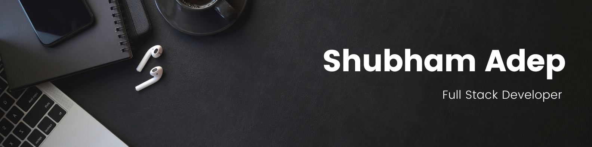

## 👋 &nbsp;Hey there! I'm Shubham 

### 👨🏻‍💻 &nbsp;About Me

- 💡 &nbsp;I like to explore new technologies and develop software solutions and quick hacks.\
- 🔭&nbsp; I’m currently working as a Software Engineer at e-Zest Digital Solution Pvt. Ltd. ...
- 🌱&nbsp; I’m currently learning next.js, tailwind css, blockchain.
- 👯&nbsp; I’m looking to collaborate on Full stack application Developement ...
- 💬&nbsp; Feel free to reach out to me for pro consulting and volunteering, or just for some interesting discussion.
- ✉️ &nbsp; You can shoot me an email at shubhamadep7218@gmail.com I'll try to respond as soon as I can.

### 🛠 &nbsp;Tech Stack

&nbsp;
&nbsp;
&nbsp;
&nbsp;
&nbsp;\
&nbsp;
&nbsp;
&nbsp;
&nbsp;
&nbsp;\
&nbsp;
&nbsp;
&nbsp;
&nbsp;
&nbsp;\
&nbsp;
&nbsp;
&nbsp;\
&nbsp;
&nbsp;
&nbsp;
&nbsp;
&nbsp;
&nbsp;

### ⚙️ &nbsp;GitHub Analytics

### 🤝🏻 &nbsp;Connect with Me

